Android系统中恐怕是没有任何一个进程有SystemServer重要了。Android的大量核心Service都运行在SystemServer上，这些核心的Service笼统的讲几乎能代表整个Android的Framework层。Android区别于Linux的关键又在于Framework层，所以更进一步讲SystemServer几乎又可代表整个Android系统了。
本文主要分析SystemServer的启动过程，分析的方法类似于从一个地方到另外一个地方的旅游，不只是单纯的到达目的地，也会欣赏沿路的风景。
<!--more-->
# SystemServer的启动路径图

```mermaid
graph TB;
  start((设备上电)) -->
  boot["BootLoader，启动准备软硬件环境"]
  boot --> kernel_init

  subgraph kernel
    kernel_init["kernel初始化<br>
    1. zImage解压缩、<br>
    2. kernel的汇编启动阶段、<br>
    3. Kernel的C启动阶段(kernel/init/main.c start_kernel())"] -->

    kernel_process["创建kernel三进程：<br>
    1. idle(swapper) pid=0<br>
    2. init pid=1 由idle 通过 kernel_thread 创建<br>
    3. kthreadd pid=2 由idle通过kernel_thread创建负责内核线程的调度管理。<br>"]
  end

  kernel_process --> init_main
  subgraph init
    init_main["/system/core/init/main.cpp 的mian方法"]

    init_main -->
    init_first_stage["/system/core/init/first_init_stage.cpp的FistStageMain 方法:<br>
    1. 设置环境变量创建<br>
    2. 创建文件系统：/dev,/proc,/sys,/mnt等。<br>
    3. execv 执行如下:/system/bin/init selinux_setup 重新进入main<br>"]

    init_first_stage -->
    init_set_selinux["/system/core/init/selinux.cpp中的SetupLinux方法。<br>
    execv执行如下：/system/bin/init second_stage 重新进入main<br>"]

    init_set_selinux -->
    init_second_stage["/system/core/init/init.cpp 的 SecondStage 方法。<br>
    1. 设置init进程的oom_socre_adj 值为-1000 <br>
    2. 注册信号SIGCHLD子进程死亡的信号处理函数: InstallSignalFdHandler，此处与下面的属性服务的socket流使用多路复用epoll。<br>
    3. 创建属性服务property_service: StartPropertyService<br>
    4. 创建Socket并等待连接。<br>"]

    init_second_stage -->
    init_initrc["init.rc 文件处理<br>
    解析/init.rc 文件，构造service_list<br>
    /init.rc 中使用import命令根据系统属性ro.zygote的值加载对应的zygote init.rc文件<br>"]

    init_initrc -->
    init_initrc_exe["init.rc 指令的执行<br>
    init 在解析完init.rc后依次执行触发器 early-init、init、late-init<br>
    在执行on late-init 时，会触发执行 zygote-start<br>
    on zygote-start，会调用命令start zygote，zygote是个service，定义在/init.${ro.zygote}.rc中<br>
    init_service_start=>subroutine: init启动service<br>
    on zygote-start 触发器描述如下：<br>
    -----------------------------------------------------------------<br>
    on zygote-start && property:ro.crypto.state=unencrypted<br>
        start netd<br>
        start zygote<br>
        start zygote_secondary<br>
    -----------------------------------------------------------------<br>
    启动的service描述如下：<br>
    -----------------------------------------------------------------<br>
    service zygote /system/bin/app_process32 -Xzygote /system/bin --zygote --start-system-server --socket-name=zygote<br>
        class main<br>
        priority -20<br>
        user root<br>
        group root readproc reserved_disk<br>
        socket zygote stream 660 root system<br>
        socket blastula_pool stream 660 root system<br>
        onrestart write /sys/android_power/request_state wake<br>
        onrestart write /sys/power/state on<br>
        onrestart restart audioserver<br>
        onrestart restart cameraserver<br>
        onrestart restart media<br>
        onrestart restart netd<br>
        onrestart restart wificond<br>
        writepid /dev/cpuset/foreground/tasks<br>
    -------------------------------------------------------------------<br>
    1. 其中的 start zygote 对应 do_start(在/system/core/init/builtins.cpp中定义)<br>
    2. 该方法会在service_list 中找到对应的service 并调用service的Start方法。<br>
    3. 使用fork和execv（方法：ExpandArgsAndExecv）组合的方式执行命令：<br>
    /system/bin/app_process32 -Xzygote /system/bin --zygote --start-system-server --socket-name=zygote<br>
    4. fork之后会根据指定的socket信息，为zygote进程创建socket。<br>"]

  end

  init_initrc_exe 
  subgraph zygote
  end

  e((系统启动完毕))
```

