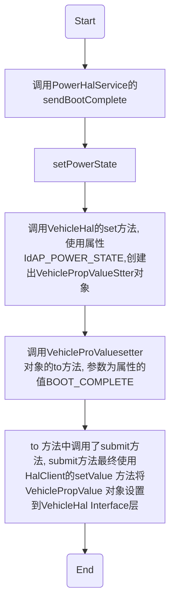

Car Service 是 android O automotive 的核心实现。第一承担部分具体业务逻辑，第二向上为Car API 提供支撑，第三向下调用android api 或者调用 Vehicle Hal 获取车辆数据，控制车辆行为。
<!-- more -->
## CarService层的构建

### CarService
Car Service层的入口实现为CarService 类。CarService 继承自Service，主要初始化在onCreate中
```java
public void onCreate() {
    Log.i(CarLog.TAG_SERVICE, "Service onCreate");
    mCanBusErrorNotifier = new CanBusErrorNotifier(this /* context */);
    mVehicle = getVehicle(null /* Any Vehicle HAL interface name */);

    if (mVehicle == null) {
        throw new IllegalStateException("Vehicle HAL service is not available.");
    }
    try {
        mVehicleInterfaceName = mVehicle.interfaceDescriptor();
    } catch (RemoteException e) {
        throw new IllegalStateException("Unable to get Vehicle HAL interface descriptor", e);
    }

    Log.i(CarLog.TAG_SERVICE, "Connected to " + mVehicleInterfaceName);

    mICarImpl = new ICarImpl(this, mVehicle, SystemInterface.getDefault(this),
            mCanBusErrorNotifier);
    mICarImpl.init();
    SystemProperties.set("boot.car_service_created", "1");

    linkToDeath(mVehicle, mVehicleDeathRecipient);

    super.onCreate();
}
```

其中主要初始化两个对象 mVehicle 与 mICarImpl。mVehicle 是 VehicleHal 在客户端（针对HAL层来说的客户端）的代理对象，它的类型为IVehicle,其实质是一个IVehicle.Proxy 对象。之后会通过此成员变量与VehicleHal进行跨进程的通信；mICarImpl 是 ICarImpl 类的实例，ICarImpl才是CarService中众多manager的真正创建着和管理者。

### ICarImpl
ICarImpl 继承自ICar.Stub，是CarService的具体实现，也作为Car API对应的真实的Service端提供服务。
在CarService 类的 OnCrate方法中，先是创建了mICarImpl对象，之后调用了该对象的init方法。接下来依次分析这两个过程。
ICarImpl的构造函数方法如下：
```java
public ICarImpl(Context serviceContext, IVehicle vehicle, SystemInterface systemInterface,
        CanBusErrorNotifier errorNotifier) {
    mContext = serviceContext;
    // 创建VehicleHal对象，该对象管理着各Service的HalService
    mHal = new VehicleHal(vehicle);
    mSystemActivityMonitoringService = new SystemActivityMonitoringService(serviceContext);
    // 电源管理服务，后续将以此为例介绍
    mCarPowerManagementService = new CarPowerManagementService(
            mHal.getPowerHal(), systemInterface);
    mCarSensorService = new CarSensorService(serviceContext, mHal.getSensorHal());
    mCarPackageManagerService = new CarPackageManagerService(serviceContext, mCarSensorService,
            mSystemActivityMonitoringService);
    mCarInputService = new CarInputService(serviceContext, mHal.getInputHal());
    mCarProjectionService = new CarProjectionService(serviceContext, mCarInputService);
    mGarageModeService = new GarageModeService(mContext, mCarPowerManagementService);
    mCarInfoService = new CarInfoService(serviceContext, mHal.getInfoHal());
    mAppFocusService = new AppFocusService(serviceContext, mSystemActivityMonitoringService);
    mCarAudioService = new CarAudioService(serviceContext, mHal.getAudioHal(),
            mCarInputService, errorNotifier);
    mCarCabinService = new CarCabinService(serviceContext, mHal.getCabinHal());
    mCarHvacService = new CarHvacService(serviceContext, mHal.getHvacHal());
    mCarRadioService = new CarRadioService(serviceContext, mHal.getRadioHal());
    mCarNightService = new CarNightService(serviceContext, mCarSensorService);
    mInstrumentClusterService = new InstrumentClusterService(serviceContext,
            mAppFocusService, mCarInputService);
    mSystemStateControllerService = new SystemStateControllerService(serviceContext,
            mCarPowerManagementService, mCarAudioService, this);
    mCarVendorExtensionService = new CarVendorExtensionService(serviceContext,
            mHal.getVendorExtensionHal());
    mPerUserCarServiceHelper = new PerUserCarServiceHelper(serviceContext);
    mCarBluetoothService = new CarBluetoothService(serviceContext, mCarCabinService,
            mCarSensorService, mPerUserCarServiceHelper);
    if (FeatureConfiguration.ENABLE_VEHICLE_MAP_SERVICE) {
        mVmsSubscriberService = new VmsSubscriberService(serviceContext, mHal.getVmsHal());
        mVmsPublisherService = new VmsPublisherService(serviceContext, mHal.getVmsHal());
    }
    if (FeatureConfiguration.ENABLE_DIAGNOSTIC) {
        mCarDiagnosticService = new CarDiagnosticService(serviceContext,
                mHal.getDiagnosticHal());
    }

    // Be careful with order. Service depending on other service should be inited later.
    // 为方便管理和遍历所有service，将所有service的引用构建为一个数组。
    List<CarServiceBase> allServices = new ArrayList<>(Arrays.asList(
            mSystemActivityMonitoringService,
            mCarPowerManagementService,
            mCarSensorService,
            mCarPackageManagerService,
            mCarInputService,
            mGarageModeService,
            mCarInfoService,
            mAppFocusService,
            mCarAudioService,
            mCarCabinService,
            mCarHvacService,
            mCarRadioService,
            mCarNightService,
            mInstrumentClusterService,
            mCarProjectionService,
            mSystemStateControllerService,
            mCarVendorExtensionService,
            mCarBluetoothService,
            mPerUserCarServiceHelper
    ));
    if (FeatureConfiguration.ENABLE_VEHICLE_MAP_SERVICE) {
        allServices.add(mVmsSubscriberService);
        allServices.add(mVmsPublisherService);
    }
    if (FeatureConfiguration.ENABLE_DIAGNOSTIC) {
        allServices.add(mCarDiagnosticService);
    }
    mAllServices = allServices.toArray(new CarServiceBase[0]);
}
```
构造方法主要内容就是构造了一堆的Service，并没有其他的东西。接下来看init：
```java
public void init() {
    // 调用VehicleHal 的init方法。
    mHal.init();
    // 循环调用各service的init方法。
    for (CarServiceBase service : mAllServices) {
        service.init();
    }
}
```
#### VehicleHal
在ICarImpl中一个比较重要的角色就是VehicleHal了，官方注释如下
> Abstraction for vehicle HAL. This class handles interface with native HAL and do basic parsing of received data (type check). Then each event is sent to corresponding {@link HalServiceBase} implementation. It is responsibility of {@link HalServiceBase} to convert data to corresponding Car*Service for Car*Manager API.

意思就是说 这个类是native HAL 的接口，会解析收到的数据，并把收到的每个事件都分发给对应的HalServiceBase的具体实现类，比方PowerHalService 就会接收并处理关于AP_power_STATE的相关事件。

VehicleHal 在ICarImpl中创建并被调用init方法。
其构造方法如下：
```java
public VehicleHal(IVehicle vehicle) {
    // 首先创建一个工作线程VEHICLE-HAL
    mHandlerThread = new HandlerThread("VEHICLE-HAL");
    mHandlerThread.start();
    // passing this should be safe as long as it is just kept and not used in constructor
    // 以下的这些service均继承自HalServiceBase
    mPowerHal = new PowerHalService(this);
    mSensorHal = new SensorHalService(this);
    mInfoHal = new InfoHalService(this);
    mAudioHal = new AudioHalService(this);
    mCabinHal = new CabinHalService(this);
    mRadioHal = new RadioHalService(this);
    mHvacHal = new HvacHalService(this);
    mInputHal = new InputHalService(this);
    mVendorExtensionHal = new VendorExtensionHalService(this);
    if (FeatureConfiguration.ENABLE_VEHICLE_MAP_SERVICE) {
        mVmsHal = new VmsHalService(this);
    }
    if(FeatureConfiguration.ENABLE_DIAGNOSTIC) {
        mDiagnosticHal = new DiagnosticHalService(this);
    }
    mAllServices.addAll(Arrays.asList(mPowerHal,
            mSensorHal,
            mInfoHal,
            mAudioHal,
            mCabinHal,
            mRadioHal,
            mHvacHal,
            mInputHal,
            mVendorExtensionHal));
    if (FeatureConfiguration.ENABLE_VEHICLE_MAP_SERVICE) {
        mAllServices.add(mVmsHal);
    }
    if(FeatureConfiguration.ENABLE_DIAGNOSTIC) {
        mAllServices.add(mDiagnosticHal);
    }
    // 创建HalClient，与VehicleHal的通信就仰赖于此。
    mHalClient = new HalClient(vehicle, mHandlerThread.getLooper(), this /*IVehicleCallback*/);
}
```
VehicleHal 创建完成后，就紧接着调用了init方法，代码如下：
```java
public void init() {
    // 首先获取所有支持的属性
    Set<VehiclePropConfig> properties;
    try {
        properties = new HashSet<>(mHalClient.getAllPropConfigs());
    } catch (RemoteException e) {
        throw new RuntimeException("Unable to retrieve vehicle property configuration", e);
    }

    synchronized (this) {
        // Create map of all properties
        for (VehiclePropConfig p : properties) {
            mAllProperties.put(p.prop, p);
        }
    }

    // 然后循环遍历所有的HALService，将HALService关心的属性与Service对应起来，保存在map中
    for (HalServiceBase service: mAllServices) {
        // 获取到各HALService 所关注的property.
        Collection<VehiclePropConfig> taken = service.takeSupportedProperties(properties);
        if (taken == null) {
            continue;
        }
        if (DBG) {
            Log.i(CarLog.TAG_HAL, "HalService " + service + " take properties " + taken.size());
        }
        synchronized (this) {
            for (VehiclePropConfig p: taken) {
                mPropertyHandlers.append(p.prop, service);
            }
        }
        properties.removeAll(taken);
        // 最后依次调用个HALService 的init 方法
        service.init();
    }
}
```
#### CarServiceBase 和 HALServiceBase
在ICarImpl中管理了众多的车辆服务，这些服务均实现了CarServiceBase接口，对应的在VehicleHAL中管理着众多的HalService 这些HALService 通过VehicleHAL中的HALClient 与 HAL层通信，处理相应的属性变化，这些HALService 均继承自HALServiceBase。例如：CarPowerManagementService 对应于 PowerHalService。
在上文中ICarImpl init 的时候会调用各CarService 的init 方法，VehicleHAL init 的时候也会调用各HALService 的 init 方法，以下以电源管理举例。
CarPowerManagementService 的 init 方法：
```java
public void init() {
    // 创建一个处理Power 业务逻辑的工作线程
    synchronized (this) {
        mHandlerThread = new HandlerThread(CarLog.TAG_POWER);
        mHandlerThread.start();
        mHandler = new PowerHandler(mHandlerThread.getLooper());
    }

    // CarPowerManagementService 同时实现了PowerHalService.PowerEventListener接口，该i
    // 接口用来从PowerHalService获取AP_POWER_STATE属性变化的事件。
    // mHal 即为PowerHalService
    mHal.setListener(this);

    // 以下为电源管理的业务逻辑，此处不分析
    if (mHal.isPowerStateSupported()) {
        mHal.sendBootComplete();
        PowerState currentState = mHal.getCurrentPowerState();
        if (currentState != null) {
            onApPowerStateChange(currentState);
        } else {
            Log.w(CarLog.TAG_POWER, "Unable to get get current power state during "
                    + "initialization");
        }
    } else {
        Log.w(CarLog.TAG_POWER, "Vehicle hal does not support power state yet.");
        onApPowerStateChange(new PowerState(PowerHalService.STATE_ON_FULL, 0));
        mSystemInterface.switchToFullWakeLock();
    }
    mSystemInterface.startDisplayStateMonitoring(this);
}
```
PowerHalService 的 init 方法如下：
```java
public synchronized void init() {
    // mProperties 在VehicleHal 初始化时调用了各HalService的takeSupportedProperties方法
    // 初始化完成，对于PowerHalService来说此处的属性为AP_POWER_STATE 和
    // DISPLAY_BRIGHTNESS.
    for (VehiclePropConfig config : mProperties.values()) {
        if (VehicleHal.isPropertySubscribable(config)) {
            // 此处的mHal 为 VehicleHal，subscribeProperty 会调用到HalClient 的subscribe 方法
            mHal.subscribeProperty(this, config.prop);
        }
    }
    VehiclePropConfig brightnessProperty = mProperties.get(DISPLAY_BRIGHTNESS);
    if (brightnessProperty != null) {
        mMaxDisplayBrightness = brightnessProperty.areaConfigs.size() > 0
                ? brightnessProperty.areaConfigs.get(0).maxInt32Value : 0;
        if (mMaxDisplayBrightness <= 0) {
            Log.w(CarLog.TAG_POWER, "Max display brightness from vehicle HAL is invalid:" +
                    mMaxDisplayBrightness);
            mMaxDisplayBrightness = 1;
        }
    }
}
```
由以上代码可知，在HalService 初始化的时候会订阅关心的属性变化，并且在CarPowerManagementService初始化时向PowerHalService注册了属性变化的回调，这样当VehicleHal相应的属性发生变化的时候就会回调到CarPowerManagementService的回调方法onApPowerStateChange 和 onDisplayBrightnessChange 方法了。

接下来详细讲解在CarService 这一层获取VehicleHal属性变化（get）和向VehicleHal 设置属性（set)的一系列流程。

## CarService 对 VehicleHAL property的读写
沿袭上文以Car Power Management 为例
### CarService层读取VehicleHAL property
#### 订阅Vehicle property
在 VehicleHal类的构造方法中创建了HALClient对象，HALClient对象的构造方法如下：
```java
// IVehicle 为 IVehicle.proxy 对象是 Vehicle Binder的客户端
// looper 为线程名为“VEHICLE-HAL” 的线程的looper，该线程在VehicleHAL对象初始化时创建
// callback 对象即为ICalImpl的实例。
HalClient(IVehicle vehicle, Looper looper, IVehicleCallback callback) {
    mVehicle = vehicle;
    Handler handler = new CallbackHandler(looper, callback);
    mInternalCallback = new VehicleCallback(handler);
}
```
在PowerHalService 的 init方法中，有如下调用
```java
mHal.subscribeProperty(this, config.prop);
```
此处的mHal 为VehicleHal 对象，VehicleHAL的subscribeProperty实现如下：
```java
public void subscribeProperty(HalServiceBase service, int property)
        throws IllegalArgumentException {
    subscribeProperty(service, property, 0f, SubscribeFlags.DEFAULT);
}

/**
 * Subscribe given property. Only Hal service owning the property can subscribe it.
 *
 * @param service HalService that owns this property
 * @param property property id (VehicleProperty)
 * @param samplingRateHz sampling rate in Hz for continuous properties
 * @param flags flags from {@link android.hardware.automotive.vehicle.V2_0.SubscribeFlags}
 * @throws IllegalArgumentException thrown if property is not supported by VHAL
 */
 // service 为PowerHalService
 // property 为AP_POWER_STATE 和 DISPLAY_BRIGHTNESS

public void subscribeProperty(HalServiceBase service, int property,
        float samplingRateHz, int flags) throws IllegalArgumentException {
    if (DBG) {
        Log.i(CarLog.TAG_HAL, "subscribeProperty, service:" + service
                + ", property: 0x" + toHexString(property));
    }
    VehiclePropConfig config;
    synchronized (this) {
        config = mAllProperties.get(property);
    }

    if (config == null) {
        // 表示此property没被支持
        throw new IllegalArgumentException("subscribe error: config is null for property 0x" +
                toHexString(property));
    // 根据property的配置判断属性是否被订阅
    } else if (isPropertySubscribable(config)) {
        SubscribeOptions opts = new SubscribeOptions();
        opts.propId = property;
        opts.sampleRate = samplingRateHz;
        opts.flags = flags;
        synchronized (this) {
            // 检验订阅该属性的service是否是该属性的所有者。
            assertServiceOwnerLocked(service, property);
            mSubscribedProperties.put(property, opts);
        }
        try {
            // 调用 HalClient 的subscribe 最终去订阅该属性。
            mHalClient.subscribe(opts);
        } catch (RemoteException e) {
            Log.e(CarLog.TAG_HAL, "Failed to subscribe to property: 0x" + property, e);
        }
    } else {
        Log.e(CarLog.TAG_HAL, "Cannot subscribe to property: " + property);
    }
}
```
接下来继续看HalClient 的 subscribe方法如下：
```java
public void subscribe(SubscribeOptions... options) throws RemoteException {
    // mVehicle 为 Vehicle Interface 的客户端，此处的mInternalCallback 为之前创
    // 建HalClient 时，使用传入的VehicleHal 对象构建的VehicleCallback 对象。当订阅的属性
    // 变化时会回调IVehicleCallback的方法。
    mVehicle.subscribe(mInternalCallback, new ArrayList<>(Arrays.asList(options)));
}
```
IVehicleCallback 共有三个方法：
```java
oneway onPropertyEvent(vec<VehiclePropValue> propValues);
oneway onPropertySet(VehiclePropValue propValue);
oneway onPropertySetError(StatusCode errorCode, int32_t propId, int32_t areaId);
```
#### 响应Vehicle属性变化
上文向Vehicle Interface订阅了属性，当Vehicle Interface上报数据后，会调用到IVehicleCallback的onPropertyEvent方法，该方法被VehicleHal实现。如下：
```java
// propValues 为当前变化了的属性值
public void onPropertyEvent(ArrayList<VehiclePropValue> propValues) {
    synchronized (this) {
        for (VehiclePropValue v : propValues) {
            // 找到在VehicleHal 初始化时绑定好的属性与处理该属性的handler。
            // 对于属性AP_POWER_STATE和DISPLAY_BRIGHTNESS来说，此处的service为PowerHalService
            HalServiceBase service = mPropertyHandlers.get(v.prop);
            if(service == null) {
                Log.e(CarLog.TAG_HAL, "HalService not found for prop: 0x"
                    + toHexString(v.prop));
                continue;
            }
            service.getDispatchList().add(v);
            mServicesToDispatch.add(service);
            VehiclePropertyEventInfo info = mEventLog.get(v.prop);
            if (info == null) {
                info = new VehiclePropertyEventInfo(v);
                mEventLog.put(v.prop, info);
            } else {
                info.addNewEvent(v);
            }
        }
    }
    for (HalServiceBase s : mServicesToDispatch) {
        // 调用HALService 的 handleHalEvents来处理Vehicle Interface的属性变化事件。
        s.handleHalEvents(s.getDispatchList());
        s.getDispatchList().clear();
    }
    mServicesToDispatch.clear();
}
```
对于Power Management来说，调用的是PowerHalService的handleHalEvents方法，其实现如下：
```java
public void handleHalEvents(List<VehiclePropValue> values) {
    PowerEventListener listener;
    synchronized (this) {
        // 如果当前没有处理该消息的回调则将上报的事件先放入队列
        if (mListener == null) {
            if (mQueuedEvents == null) {
                mQueuedEvents = new LinkedList<>();
            }
            mQueuedEvents.addAll(values);
            return;
        }
        // mListener 为CarPowerManagementService初始化时向PowerHalService设置的listener
        // CarPowerManagementService 实现了该PowerEventListener
        // PowerEventListener 有两个方法：onApPowerStateChange 和 onDisplayBrightnessChange
        listener = mListener;
    }

    // 分发处理该此属性变化事件
    dispatchEvents(values, listener);
}

private void dispatchEvents(List<VehiclePropValue> values, PowerEventListener listener) {
    for (VehiclePropValue v : values) {
        switch (v.prop) {
            case AP_POWER_STATE:
                int state = v.value.int32Values.get(VehicleApPowerStateIndex.STATE);
                int param = v.value.int32Values.get(VehicleApPowerStateIndex.ADDITIONAL);
                // 如果为AP_POWER_STATE 则调用onApPowerStateChange
                listener.onApPowerStateChange(new PowerState(state, param));
                break;
            case DISPLAY_BRIGHTNESS:
                int maxBrightness;
                synchronized (this) {
                    maxBrightness = mMaxDisplayBrightness;
                }
                // 如果为DISPLAY_BRIGHTNESS 则调用onDisplayBrightnessChange
                listener.onDisplayBrightnessChange(
                        (v.value.int32Values.get(0) * 100) / maxBrightness);
                break;
        }
    }
}
```
如此则回调到CarPowerManagementService中，最终完成对AP_POWER_STATE 和 DISPLAY_BRIGHTNESS属性变化的处理。
### CarService 向 Vehicle Hal Interface Set 属性值。
相对简单一些，已Power Management 在初始化时向Vehicle 同步启动完成状态为例

至此，CarService 以Power Management 举例的分析就结束了，各业务的Service具体实现可能不同，但是整体结构大体上是一致的。
