Android系统中恐怕是没有任何一个进程有SystemServer重要了。Android的大量核心Service都运行在SystemServer上，这些核心的Service笼统的讲几乎能代表整个Android的Framework层。Android区别于Linux的关键又在于Framework层，所以更进一步讲SystemServer几乎又可代表整个Android系统了。
本文主要分析SystemServer的启动过程，分析的方法类似于从一个地方到另外一个地方的旅游，不只是单纯的到达目的地，也会欣赏沿路的风景。
<!--more-->
# SystemServer的启动路径图

```mermaid
graph TB;
  start((设备上电)) -->
  boot["BootLoader，启动准备软硬件环境"]
  boot --> kernel_init

  subgraph kernel
    kernel_init["kernel初始化<br>
    1. zImage解压缩、<br>
    2. kernel的汇编启动阶段、<br>
    3. Kernel的C启动阶段(kernel/init/main.c start_kernel())"] -->

    kernel_process["创建kernel三进程：<br>
    1. idle(swapper) pid=0<br>
    2. init pid=1 由idle 通过 kernel_thread 创建<br>
    3. kthreadd pid=2 由idle通过kernel_thread创建负责内核线程的调度管理。<br>"]
  end

  kernel_process --> init_main
  subgraph init
    init_main["/system/core/init/main.cpp 的mian方法"]

    init_main -->
    init_first_stage["/system/core/init/first_init_stage.cpp的FistStageMain 方法:<br>
    1. 设置环境变量创建<br>
    2. 创建文件系统：/dev,/proc,/sys,/mnt等。<br>
    3. execv 执行如下:/system/bin/init selinux_setup 重新进入main<br>"]

    init_first_stage -->
    init_set_selinux["/system/core/init/selinux.cpp中的SetupLinux方法。<br>
    execv执行如下：/system/bin/init second_stage 重新进入main<br>"]

    init_set_selinux -->
    init_second_stage["/system/core/init/init.cpp 的 SecondStage 方法。<br>
    1. 设置init进程的oom_socre_adj 值为-1000 <br>
    2. 注册信号SIGCHLD子进程死亡的信号处理函数: InstallSignalFdHandler，此处与下面的属性服务的socket流使用多路复用epoll。<br>
    3. 创建属性服务property_service: StartPropertyService<br>
    4. 创建Socket并等待连接。<br>"]

    init_second_stage -->
    init_initrc["init.rc 文件处理<br>
    解析/init.rc 文件，构造service_list<br>
    /init.rc 中使用import命令根据系统属性ro.zygote的值加载对应的zygote init.rc文件<br>"]

    init_initrc -->
    init_initrc_exe["init.rc 指令的执行<br>
    init 在解析完init.rc后依次执行触发器 early-init、init、late-init<br>
    在执行on late-init 时，会触发执行 zygote-start<br>
    on zygote-start，会调用命令start zygote，zygote是个service，定义在/init.${ro.zygote}.rc中<br>
    init_service_start=>subroutine: init启动service<br>
    on zygote-start 触发器描述如下：<br>
    -----------------------------------------------------------------<br>
    on zygote-start && property:ro.crypto.state=unencrypted<br>
        start netd<br>
        start zygote<br>
        start zygote_secondary<br>
    -----------------------------------------------------------------<br>
    启动的service描述如下：<br>
    -----------------------------------------------------------------<br>
    service zygote /system/bin/app_process32 -Xzygote /system/bin --zygote --start-system-server --socket-name=zygote<br>
        class main<br>
        priority -20<br>
        user root<br>
        group root readproc reserved_disk<br>
        socket zygote stream 660 root system<br>
        socket blastula_pool stream 660 root system<br>
        onrestart write /sys/android_power/request_state wake<br>
        onrestart write /sys/power/state on<br>
        onrestart restart audioserver<br>
        onrestart restart cameraserver<br>
        onrestart restart media<br>
        onrestart restart netd<br>
        onrestart restart wificond<br>
        writepid /dev/cpuset/foreground/tasks<br>
    -------------------------------------------------------------------<br>
    1. 其中的 start zygote 对应 do_start(在/system/core/init/builtins.cpp中定义)<br>
    2. 该方法会在service_list 中找到对应的service 并调用service的Start方法。<br>
    3. 使用fork和execv（方法：ExpandArgsAndExecv）组合的方式执行命令：<br>
    /system/bin/app_process32 -Xzygote /system/bin --zygote --start-system-server --socket-name=zygote<br>
    4. fork之后会根据指定的socket信息，为zygote进程创建socket。<br>"]

  end

  init_initrc_exe --> app_process
  subgraph zygote
    app_process["
      app_process 位于/frameworks/base/cmds/app_process/app_main.cpp 中
    "]

    app_process --> app_runtime
    subgraph app_runtime_init
      app_runtime["创建AppRuntime对象<br>
        AppRuntime继承自AndroidRuntime，调用其构造方法。
      "]

      app_runtime -->
      android_runtime["AndroidRuntime初始化<br>
        初始化Skia图形系统
      "]
    end

    android_runtime -->
    arg_init["解析参数<br>
      1. 根据传入的参数zygot启动标记为true，设置zygote niceName 为 zygote/zygote64<br>
      2. 设置startSystemServer 启动标记为ture。<br>
      3. 在参数中添加--abi-list=${ro.product.cpu.abilist} 参数<br>
    "]

    arg_init --> android_runtime_start
    subgraph app_runtime_start
      android_runtime_start["调用AndroidRuntime.Start方法<br>
        1. 指定android rootdir 为 /system <br>
        2. 调用startVm 创建Java虚拟机 <br>
        3. 回调，onVmCreated 在AndroidRuntime的子类AppRuntime中实现。
      "]

      android_runtime_start -->
      register_android_function["向VM注册android native functions<br>
        1. 注册到VM的native方法定义在/frameworks/base/core/jni/AnroidRuntime.cpp 的全局变量gRegJNI中。<br>
        2. 调用ZygoteInit的main方法<br>
      "]
    end

    register_android_function --> zygote_init
    subgraph ZygoteInit
      zygote_init["ZygoteInit.main<br>
        1. 位于/frameworks/base/core/java/com.android.internel.os.ZygoteInit<br>
        2. 创建ZogyteServer并标记启动 <br>
        3. 设置进程pid和gid为0<br>
        4. 解析参数<br>
        5. 调用ZygoteServer.createZygoteSocket创建本地socket服务<br>
        6. 调用preload方法预加载系统类和资源<br>
        7. fork SystemServer进程<br>
      "]

      zygote_init -->
      select_loop["
        8. 启动ZogyteServer的selectLoop线程处理子进程的命令<br>
        tips:<br>
        zygote 是受精卵的意思<br>在阅读代码的时候发现对比较早之前版本在zygote中出现了blastula<br>blastula是囊胚的意思，是胚胎发育的下个阶段<br>在囊胚期后，胚胎的全能细胞开始分化逐渐形成各种器官。<br>zygote会创建一个blastula的池，并用固定数量的blastula进程填充了该池<br>这些提前fork好的进程有利用加快应用的启动。<br>
      "]

      zygote_init -->
      system_server_fork["fork SystemServer进程<br>
        1. 调用forkSystemServer方法<br>
        2. 调用Zygote.forkSystemServer 并进一步调用 NativeForkSystemServer<br>
        3. 传入的参数为<br>
        String args[] = {<br>
                --setuid=1000,
                --setgid=1000,<br>
                --setgroups=1001,1002,1003,1004,1005,1006,1007,1008,1009,101
                0,1018,1021,1023,1024,1032,1065,3001,3002,3003,3006,3007,3009,3010,<br>
                --capabilities=,<br>
                --nice-name=system_server,<br>
                --runtime-args,<br>
                --target-sdk-version=VMRuntime.SDK_VERSION_CUR_DEVELOPMENT,
                com.android.server.SystemServer,<br>
        };<br>
        4. 调用SystemServer的main方法。
      "]

      system_server_fork -->
      system_server_native_fork["native fork system server<br>
        1. 位于/frameworks/base/core/jni/com_android_internal_os_zygote.cpp<br>
        2. fork之后在子进程（system_server进程）调用SpecializeCommon方法<br>
        3. 回掉Java层的ZygoteInit.callPostForkSystemServerHooks<br>
        该方法在ZygoteHooks中最终调用nativePostForkSystemServer<br>
        ZygoteHooks的native方法在/art/runtime/dalvik_system_ZygoteHooks.cc中<br>
        4. 回调Java层的Zygote的postForkChild，该方法同样回调ZygoteHooks中的对应方法
      "]

      system_server_native_fork --> handle_system_server_process
      subgraph handleSystemServerProcess
        handle_system_server_process["handleSystemServerProcess方法<br>
          1. 从环境变量SYSTEMSERVERCLASSPATH中获取到systemServerClassPath<br>
          值为：/system/framework/services.jar:/system/framework/ethernet-service.jar:/system/framework/wifi-service.jar<br>
          2. 创建SystemServer的ClassLoader并存起来。
        "]

        handle_system_server_process -->
        native_zygote_init["nativeZygoteInit
          1. 方法位于/frameworks/base/core/jni/AndroidRuntime.cpp中<br>
          2. 该方法调用其子类AppRuntime的onZygoteInit方法<br>
          3. onZygoteInit创建了ProcessState对象，并调用了该对象的startThreadPoll方法<br>ProcessState的构造函数会打开binder设备，startThreadPoll会创建binder线程，为进程提供了使用binder通信的能力<br>
        "]

        native_zygote_init -->
        runtime_init["applicationInit构造出system_server main 方法的 MethodAndArgsCaller Runnable对象。<br>
        "]
      end
    end
  end

  runtime_init --> system_server_main
  subgraph SystemServer
    system_server_main["在SystemServer进程内通过MethodAndArgsCaller对象调用SystemServer入口方法main<br>
      1. 创建SystemServer对象，调用其run方法。<br>
      tips:<br>
      通过创建一个Runnable对象将对main方法的调用返回回来，然后在systemserver进程内进行调用，<br>可以使systemserver进程内的调用栈清空，而main方法是栈顶。
    "]

    system_server_main -->
    system_server_run["SystemServer run 方法<br>
    调整时间，如果系统时间比1970还要早，调整到1970年
      1. 设置语言<br>
      2. 调整虚拟机堆内存大小和内存利用率<br>
      3. 调整binder最大线程数为31+1<br>
      3. 初始化Looper为mainLooper<br>
      4. 装载库libandroid_server.so<br>
      5. 初始化系统Context<br>
      6. 创建SystemServiceManager负责系统Service启动<br>
      7. 创建和启动Java服务<br>
      8. 调用Looper.loop()，进入处理消息的循环<br>
    "]
  end

  system_server_run -->
  ams_pms("启动ActivityManagerService<br>启动PackageManagerService等")

  system_server_run -->
  system_other_service("startOtherService执行")

  ams_pms --pms启动完成-->
  system_ready("标记systemready")
  system_other_service --执行结束--> system_ready

  system_ready -->
  ui("启动systemui，launcher")

  ui --> e((系统启动完毕))
```

以上，就是从上电到桌面启动的全过程。
# SystemServer 启动的Eventlog
根据开机过程中的event log 信息，可以看到systemserver启动的整个过程
执行命令如下
```bash
adb logcat -v thradtime -b events | grep boot
```
输出结果
```bash
10-05 00:00:01.164   376   376 I boot_progress_start: 6440
09-18 11:16:52.257   376   376 I boot_progress_preload_start: 8436
09-18 11:16:55.166   376   376 I boot_progress_preload_end: 11346
09-18 11:16:55.383   929   929 I boot_progress_system_run: 11562
09-18 11:16:55.876   929   929 I boot_progress_pms_start: 12056
09-18 11:16:56.081   929   929 I boot_progress_pms_system_scan_start: 12261
09-18 11:16:58.082   929   929 I boot_progress_pms_data_scan_start: 14262
09-18 11:17:08.892   929   929 I boot_progress_pms_scan_end: 25072
09-18 11:17:08.949   929   929 I boot_progress_pms_ready: 25129
09-18 11:17:10.228   929   929 I boot_progress_ams_ready: 26407
09-18 11:17:13.203   929   952 I boot_progress_enable_screen: 29383
09-18 11:17:15.030   292   292 I sf_frame_dur: [BootAnimation,14,334,6,1,1,0,0]
```
分析

| 启动阶段 | 阶段开始 | 阶段结束 | 耗时(ms) |
| - | - | - | - |
| kernel | | boot_progress_start(16373) | 6440 |
| zygote启动预加载 | boot_progress_preload_start(8436) | boot_progress_preload_end(11346) | 2910 |
| system目录扫描 | boot_progress_pms_system_scan_start(12261) | boot_progress_pms_data_scan_start(14262) | 2001 |
| data目录扫描 | boot_progress_pms_data_scan_start(14262) | boot_progress_pms_scan_end(25072) | 10810 |
| home activity启动 | boot_progress_ams_ready(26407) | boot_progress_enable_screen(29383) | 2976 |
| home activity等待boot animation结束 | boot_progress_enable_screen(29383) | sf_frame_dur | 1827 |
